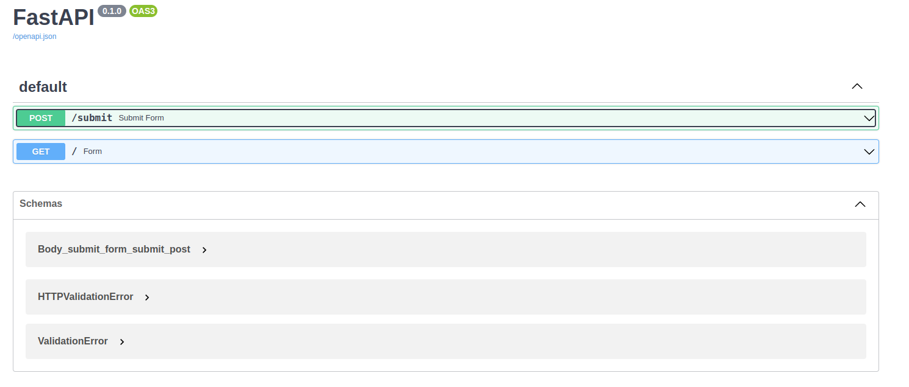

# cell_cancer_model_api
This API utilizes FastAPI to deploy a cancer cell classification model: [reference](https://github.com/sabinorsp/cancer_data_classification).

---

## How to run:

1 - Clone the repository: 
```shell
git clone https://github.com/sabinorsp/cell_cancer_model_api.git
```

2 - In the project folder, create a virtual Python environment and activate it using the following commands::
```shell
python3 -m venv env
source env/bin/activate
```
3 - Install the requirements.txt:
```shell
pip install -r requirements.txt
```

4 - Go to app folder and run the uvicorn application:
```shell
uvicorn main:app --reload
```
5 - Open your browser and go to http://localhost:8000.

This is an example of model deployment using FastAPI. To run this example with default values, simply leave all form fields blank and click 'predict'. This will open a pre-selected set of default values and return the 'model.predict' endpoint." 

API docs: 

<p align="center">
  
</p>

---